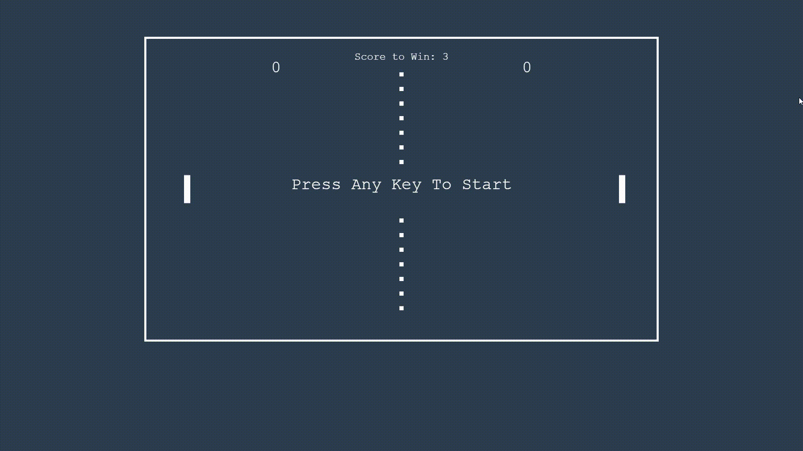

# Pong Game Project

## Table of Contents

- [Preview](#preview)
- [Introduction](#introduction)
- [Built Using](#built-using)
- [Features](#features)
- [How to Play](#how-to-play)
- [Acknowledgments](#acknowledgments)
- [License](#license)

## Preview

## Introduction

This project, the "Pong Game", was developed as a frontend practice exercise to enhance skills in HTML5, CSS3, and JavaScript. The project draws inspiration from the classic Pong arcade game, offering an interactive and enjoyable gaming experience.

## Built Using

## Features

- **User vs AI Challenge**: Take on the AI opponent in thrilling one-on-one matches for an enjoyable gaming experience.

- **Fluid Gameplay**: Experience responsive paddle and ball movements that enhance the flow of the game.

- **Score Management**: Keep tabs on player scores effortlessly, making it clear who's leading the match.

- **Immersive Sound**: Dive into the game with subtle audio effects that enhance the overall atmosphere.

## How to Play

1. Access the live demo [here](https://maorbezalel.github.io/pong-game/).
2. Control the left paddle using keyboard arrow keys or 'w' and 's' keys.
3. Bounce the ball off the paddles to prevent it from reaching your side.
4. Score points by making the ball pass your opponent's paddle.
5. The first player to reach the specified score wins!
6. Enjoy! 🎮🕹️🚀

### License

This project is licensed under the MIT License - see the [LICENSE](LICENSE) file for details.
